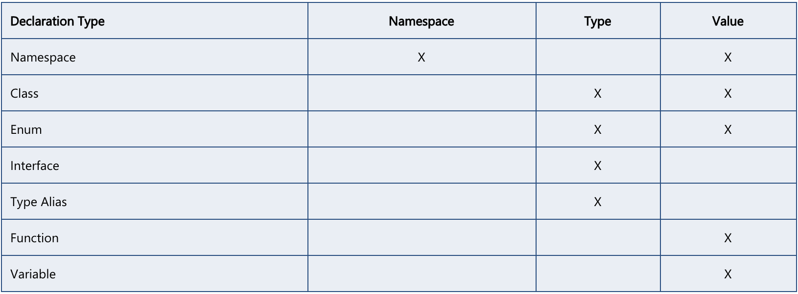

# typescript

## 基础类型

包含基础类型： `number，boolean，string，null，undefined`

复杂类型： `Array<number> or string[], tuple, enum，object`

特殊类型： `Any, void，Never(永不存在的值的类型, eg: 包含 throw '' 的函数)`

ES6: `Symbol`

高级类型： 联合类型(tuple 会引出联合类型概念), 交叉类型, 默认类型。 参考：[advancedTypes](./advancedTypes.md)

> 类型：
```typeScript
// base
let x: null = null;
let unusable: void = undefined;

function warnUser(): void {

}

// any
let x: Any = 10;
x = true;
let list: any[] = [1, true, "free"];
```

> tuple
```typeScript
// Declare a tuple type
let x: [string, number];
// Initialize it
x = ['hello', 10]; // OK
// Initialize it incorrectly
x = [10, 'hello']; // Error
// error: Type '[string, number, number]' is not assignable to type '[string, number]'.
// 溢出赋值是错误的，但是允许 x[3] = 10, 这么赋值， 赋值类型为声明时的联合类型。
x = [10, 'hello', 10];

x[3] = 'world'; // OK, 字符串可以赋值给(string | number)类型 【这就是联合类型。】
console.log(x[5].toString()); // OK, 'string' 和 'number' 都有 toString。 联合类型的特征
x[6] = true; // Error, 布尔不是(string | number)类型
```

联合类型 & 交叉类型
```typescript
let x: [string | number] = ['2'];
x.push(10);

let x: string | number = '2';
// 不能将类型“true”分配给类型“string | number”。
x = true;

// 交叉类型， 交叉类型对于基础类型没有意义。但是对存在继承关系的类型是个和好的限定, 参考： advancedTypes.md
let x: string & number = undefined;
let y: string & number = null;

// 没有给值为定义的确定类型之前默认是 undefuned， 可以赋这两个特殊值。
x = null;
y = undefined;
```

> enum: [enum desc](https://www.tslang.cn/docs/handbook/enums.html)

- TypeScript支持数字的和基于字符串的枚举。
- 字符串枚举会有枚举值推断的特性，但字符串枚举没有自增长的行为，字符串枚举可以很好的序列化
- 异构枚举: 允许一组枚举的值包含不同类型。

```typescript
// 字符串枚举 : 自定义初始值
enum SEASON { spring = 'spring', summer = 'summer', autumu = 'autumn', winter = 'winter' };
// 枚举值包含字符串则不允许出现计算常量
let base: number = 10;
enum P {
    y = '1',
    x = ++ base,    // error 含字符串值成员的枚举中不允许使用计算值。
    z = base,    // error 含字符串值成员的枚举中不允许使用计算值。
}

// 异构枚举: 允许但是尽量避免
enum BooleanLikeHeterogeneousEnum {
    No = 0,
    Yes = "YES",
}

// 如下部分比较麻烦，建议参考官方文档。
// 数值枚举：tsc 会去尝试推断其他枚举的值。推断规则如下：
//      枚举的第一个成员且没有初始化器，这种情况下它被赋予值 0：
//      没有初始化器且它之前的枚举成员是一个 数字常量。 这种情况下，当前枚举成员的值为它上一个枚举成员的值加1。
//      但如果你显式给的值不能被推断则余下的部分需要手动赋值

// 反向映射: 对于 number 类型的枚举值， 会产生一个对应下标的索引， 如下： up： 1， 1： 'up'
// 这种推断需要建立在常量基础上, 如果是个生成常量的求值操作,常量引用，则不可被推断
enum Direction {
    Up = 1,
    Down,
    Left,
    Right
}
console.log(Direction);     // { 1: "Up", 2: "Down", 3: "Left", 4: "Right", Up: 1, Down: 2, Left: 3, Right: 4 }

enum T { a = 1, b, c = 10, d = 100, f }     // { 1: "a", 2: "b", 10: "c", 100: "d", 101: "f", a: 1, b: 2, c: 10, d: 100, f: 101 }

// 不可推断
let base = 10;
enum P {
    x = ++ base,
    y;  // error 需要显式赋值不可推断
}

// 联合枚举与枚举成员的类型, 运行时的枚举,  建议参考官方文档。

// 反向映射: 数字枚举成员还具有了 反向映射，从枚举值到枚举名字
enum Enum {
    A
}       // { 0: "A", A: 0 }
let a = Enum.A;
let nameOfA = Enum[a]; // "A"

// 枚举值之间求等
enum P {
    x,
    y
}
// 运行时的枚举，枚举是在运行时真正存在的对象
let {x, y} = P
console.log(x === y);   // error: This condition will always return 'false' since the types 'P.x' and 'P.y' have no overlap.

// 常量枚举, 外部枚举 建议参考官方文档。
const enum Enum {
    A = 1,
    B = A * 2
}

// 特殊情况下的推断, 略显尴尬
enum P {
    A = 1,
    B ,
    C = 2
}   // { 1: "A", 2: "C", A: 1, B: 2, C: 2 }

```

Never
```typescript
// 返回never的函数必须存在无法达到的终点
function infiniteLoop(): never {
    while (true) {
    }
}

// 返回never的函数必须存在无法达到的终点
function error(message: string): never {
    throw new Error(message);
}
```

Symbol

- Symbols是不可改变且唯一
- 像字符串一样，symbols也可以被用做对象属性的键。
- symbol 的 [api 参考](https://www.tslang.cn/docs/handbook/symbols.html)

```typescript
let sym2 = Symbol("key");
let sym3 = Symbol("key");

sym2 === sym3; // false, symbols是唯一的

let sym = Symbol();

let obj = {
    [sym]: "value"
};

console.log(obj[sym]); // "value"
```


---


## 类型断言

有时候你会遇到这样的情况，你会比TypeScript更了解某个值的详细信息。 通常这会发生在你清楚地知道一个实体具有比它现有类型更确切的类型。简单来讲就是告诉编译器这就是这个类型，从而通过检查。

常见于交叉类型。

eg1： 一个常见场景是： 接口有个特性是额外属性检查, 不允许传入接口约定之外的字段(如下的 oth 字段无法通过编译。)。这时候就需要类型断言
```typescript
interface SquareConfig {
    color?: string;
    width?: number;
}

function createSquare({ color = 'white', width = 0 }: SquareConfig): { color: string; area: number } {
    return { area: width ** 2, color };
}

// error: 'oth' not expected in type 'SquareConfig'
let mySquare = createSquare({ color: "red", width: 100, oth: true });

// right
mySquare = createSquare(<SquareConfig>{ color: "red", width: 100, oth: true });
// or
mySquare = createSquare({ color: "red", width: 100, oth: true } as SquareConfig);
```

eg2：函数默认值类型断言。解构 + 默认值最安全的方式是 `{ a = true， b = 10} = {}` 在 ts 中却通不过编译，需要类型断言
```typescript
interface SquareConfig {
    color: string;
    width: number;
}

// error 不能将类型“{}”分配给类型“SquareConfig”。 类型“{}”中缺少属性“color”。
// function createSquare({ color = 'white', width = 0 }: SquareConfig = {}): void {
// right
function createSquare({ color = 'white', width = 0 }: SquareConfig = <SquareConfig>{}): void {
    // console.log(color, width);
}

createSquare();
```


---


## 类型声明

参考 es6 的 let 和 const 即可，添加了级块作用域，以大括号为级块，弥补的都是 var 带来的坑。


---


## 类型推论: [类型推论 doc](https://www.tslang.cn/docs/handbook/type-inference.html)

在有些没有明确指出类型的地方，类型推论会帮助提供类型, 如果依赖这个特性，和不用 TS 在写法上，差不多

---


## 解构 & 展开/聚合

参考高版本 ECMAscript 对象数组都支持解构，比较强大, 解构的原则是模式匹配，不管怎么复杂，找准模式即可。
```typescript
// 复杂解构
const { a: [{ a: name }, a2], b: { c, d: { e, f } } } = { a: [{ a: 2 }, '5'], b: { c: 10, d: { e: true, f: 'last' } } };

// 解构 + 默认值 + 类型约束： 略麻烦
function names({ a, b} : {a: string, b: number } = { a: '1', b: 2 }) {}

// 展开操作符，可以展开对象，在接受参数的时候承担剩余参数聚合的作用
let defaults = { food: "spicy", price: "$$", ambiance: "noisy" };
let search = { ...defaults, food: "rich" };
```


---


## Type Compatibility (类型兼容性)

TypeScript 里的类型兼容性是基于结构子类型的。 结构子类型是一种只使用其成员来描述类型的方式。

它正好与名义（nominal）类型形成对比(C#或Java)。（译者注：在基于名义类型的类型系统中，数据类型的兼容性或等价性是通过明确的声明和/或类型的名称来决定的。这与结构性类型系统不同，它是基于类型的组成结构，且不要求明确地声明。）

TypeScript的结构性子类型是根据JavaScript代码的典型写法来设计的。 因为JavaScript里广泛地使用匿名对象，例如函数表达式和对象字面量，所以使用结构类型系统来描述这些类型比使用名义类型系统更好。

TypeScript的类型系统允许某些在编译阶段无法确认其安全性的操作

> 基本规则： 包含式。

如果x要兼容y，那么y至少具有与x相同的属性, 也就是说必须是超集， 反过来则不成立。

只有目标类型（相同属性）的成员会被一一检查是否兼容。这个比较过程是递归进行的，检查每个成员及子成员。
```typescript
interface Named {
    name: string;
}

let x: Named;
// y's inferred type is { name: string; location: string; }
let y = { name: 'Alice', location: 'Seattle' };
x = y;
// error
// y = x;
```


### 类

类有静态部分和实例部分的类型。 比较两个类类型的对象时，只有实例的成员会被比较。 静态成员和构造函数不在比较的范围内。

> 类的私有成员

私有成员会影响兼容性判断。 当类的实例用来检查兼容时，如果目标类型包含一个私有成员，那么源类型必须包含来自同一个类的这个私有成员。 这允许子类赋值给父类，但是不能赋值给其它有同样类型的类。

> 子类型与赋值

目前为止，我们使用了兼容性，它在语言规范里没有定义。 在TypeScript里，有两种类型的兼容性：子类型与赋值。 它们的不同点在于，赋值扩展了子类型兼容，允许给 any 赋值或从 any 取值和允许数字赋值给枚举类型或枚举类型赋值给数字。

语言里的不同地方分别使用了它们之中的机制。 实际上，类型兼容性是由赋值兼容性来控制的，即使在implements和extends语句也不例外。


---


## 声明合并

令人吃惊的操作: “声明合并”是指编译器将针对同一个名字的两个独立声明合并为单一声明。 合并后的声明同时拥有原先两个声明的特性。 任何数量的声明都可被合并；不局限于两个声明。

```typescript
interface Box {
    height: number;
    width: number;
}

interface Box {
    scale: number;
    // error: 标识符“scale”重复
    // scale: number;
}

// three box ? fuck
class Box {
    length: number;

    // error: 接口的非函数的成员应该是唯一的。如果它们不是唯一的，那么它们必须是相同的类型。
    // 如果两个接口中同时声明了同名的非函数成员且它们的类型不同，则编译器会报错
    // width: string;
    // 允许声明合并的不同声明体中存在同名的属性。
    width: number;
}

// 标识符“Box”重复。
// class Box {

// }

// 缺少属性“length”
// let boxErr: Box = { height: 5, width: 6, scale: 10 };
let box: Box = { height: 5, width: 6, scale: 10, length: 7 };
console.log(box);
```

TypeScript中的声明会创建以下三种实体之一：命名空间，类型或值。

- 创建命名空间的声明会新建一个命名空间，它包含了用（.）符号来访问时使用的名字。
- 创建类型的声明是：用声明的模型创建一个类型并绑定到给定的名字上。
- 创建值的声明会创建在JavaScript输出中看到的值。




1. 接口声明合并

> 综合来讲没有发现这个特性比较贴切的场景，无论是扩展，还是代码组织方面，都挺别扭的，而且比起声明合并，都有更好的方案。待发现

接口的非函数的成员应该是唯一的。如果它们不是唯一的，那么它们必须是相同的类型，如上述代码。

对于函数成员，每个同名函数声明都会被当成这个函数的一个重载。 同时需要注意，当接口 A与后来的接口 A合并时，后面的接口具有更高的优先级。

```typescript
interface Cloner {
    clone(animal: Animal): Animal;
}

interface Cloner {
    clone(animal: Sheep): Sheep;
}

interface Cloner {
    clone(animal: Dog): Dog;
    clone(animal: Cat): Cat;
}

// 这三个接口合并成一个声明： 注意每组接口里的声明顺序保持不变，但各组接口之间的顺序是后来的接口重载出现在靠前位置。
interface Cloner {
    clone(animal: Dog): Dog;
    clone(animal: Cat): Cat;
    clone(animal: Sheep): Sheep;
    clone(animal: Animal): Animal;
}
```

这个规则有一个例外是当出现特殊的函数签名时。 如果签名里有一个参数的类型是 单一的字符串字面量（比如，不是字符串字面量的联合类型），那么它将会被提升到重载列表的最顶端.....

2.  命名空间的合并, 命名空间与类和函数和枚举类型合并 之类的。

说实话，感觉这个语法没什么卵用，无论是从设计角度还是合理性上，没有理由将本身内聚的设计，写成分散的，但在使用上又是合并的。这部分可以参考原文：

[声明合并, 模块扩展](https://www.tslang.cn/docs/handbook/declaration-merging.html)

3. 合并命名空间和类: 实现部分模式

   - 内部类：
    ```typescript
    class Album {
        label: Album.AlbumLabel;
    }
    namespace Album {
        export class AlbumLabel { }
    }
    ```

   - 成员扩展: 创建一个函数稍后扩展它增加一些属性也是很常见的
    ```typescript
    function buildLabel(name: string): string {
        return buildLabel.prefix + name + buildLabel.suffix;
    }

    namespace buildLabel {
        export let suffix = "";
        export let prefix = "Hello, ";
    }

    console.log(buildLabel("Sam Smith"));
    ```
    枚举同理

4. 非法的合并

TypeScript并非允许所有的合并。 目前，类不能与其它类或变量合并。 想要了解如何模仿类的合并，请参考 TypeScript的混入。

5. 全局扩展
```typescript
// observable.ts
export class Observable<T> {
    // ... still no implementation ...
}

declare global {
    interface Array<T> {
        toObservable(): Observable<T>;
    }
}

// 等价
Array.prototype.toObservable = function () {
    // ...
}
```
