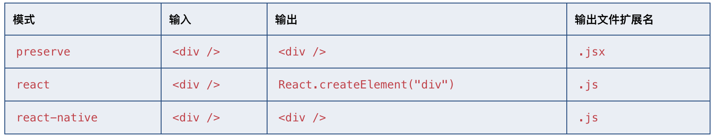

# JSX

> react

## 基本用法

前置条件

- 给文件一个.tsx扩展名
- 启用jsx选项: 你可以通过在命令行里使用--jsx标记或tsconfig.json里的选项来指定模式。

TypeScript具有三种JSX模式：preserve，react和react-native。 这些模式只在代码生成阶段起作用 - 类型检查并不受影响。

- preserve模式下生成代码中会保留JSX以供后续的转换操作使用（比如：Babel）。 另外，输出文件会带有.jsx扩展名。
- react模式会生成React.createElement，在使用前不需要再进行转换操作了，输出文件的扩展名为.js。
- react-native相当于preserve，它也保留了所有的JSX，但是输出文件的扩展名是.js。

jsx 这部分单独说明。
