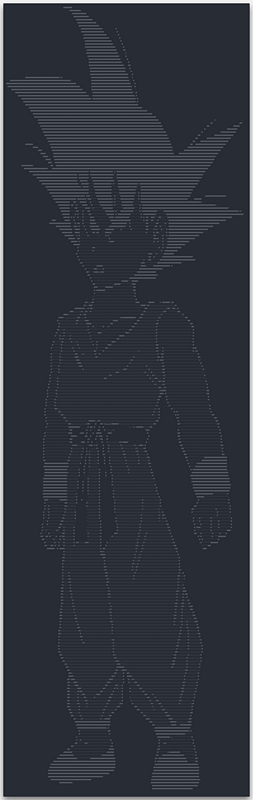
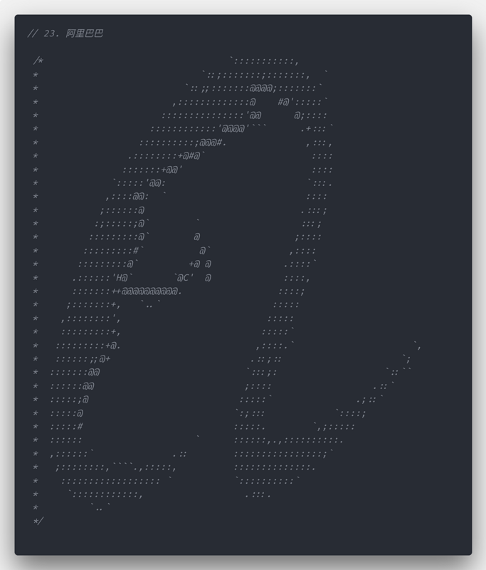
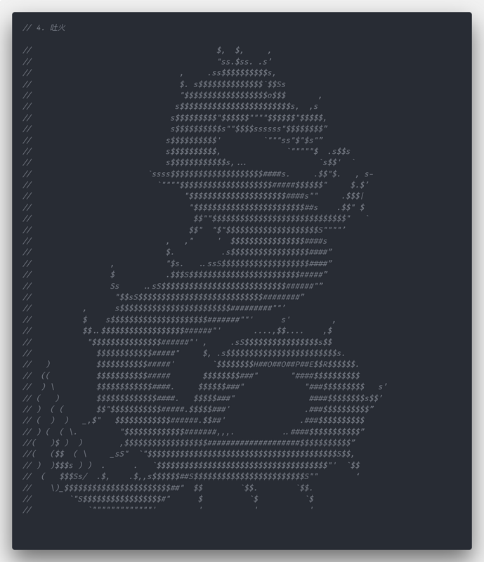
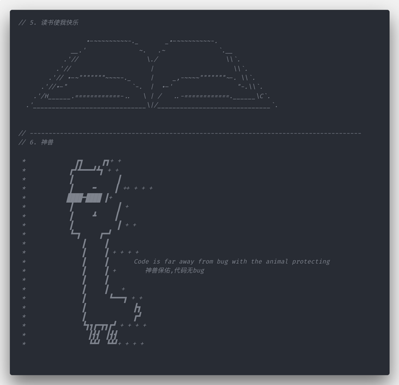
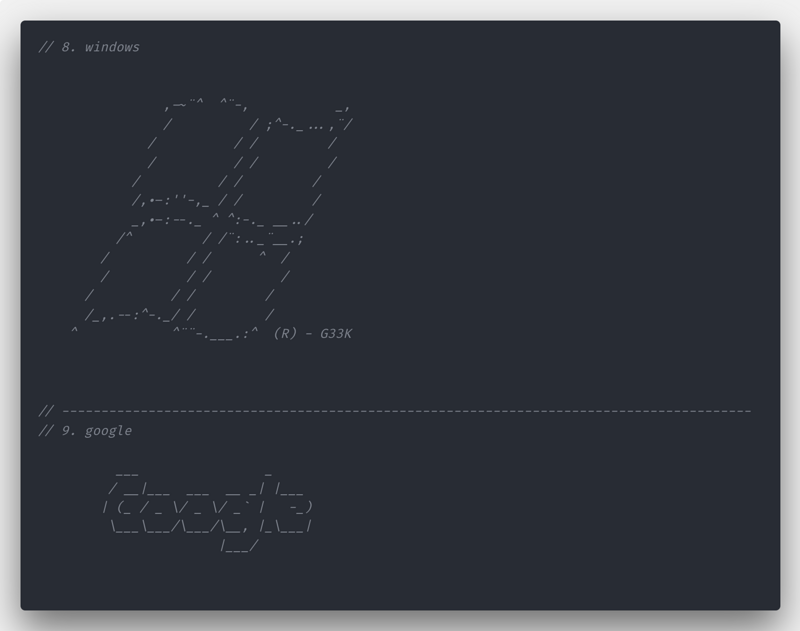
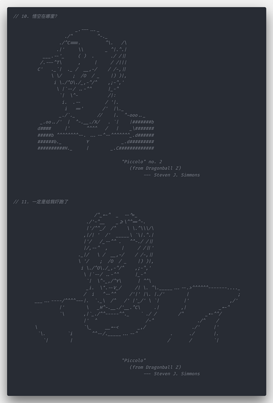
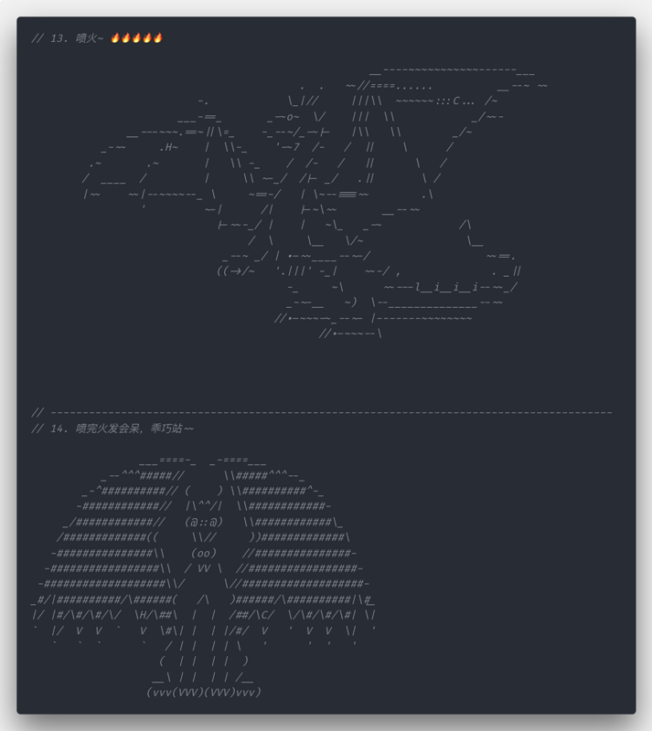
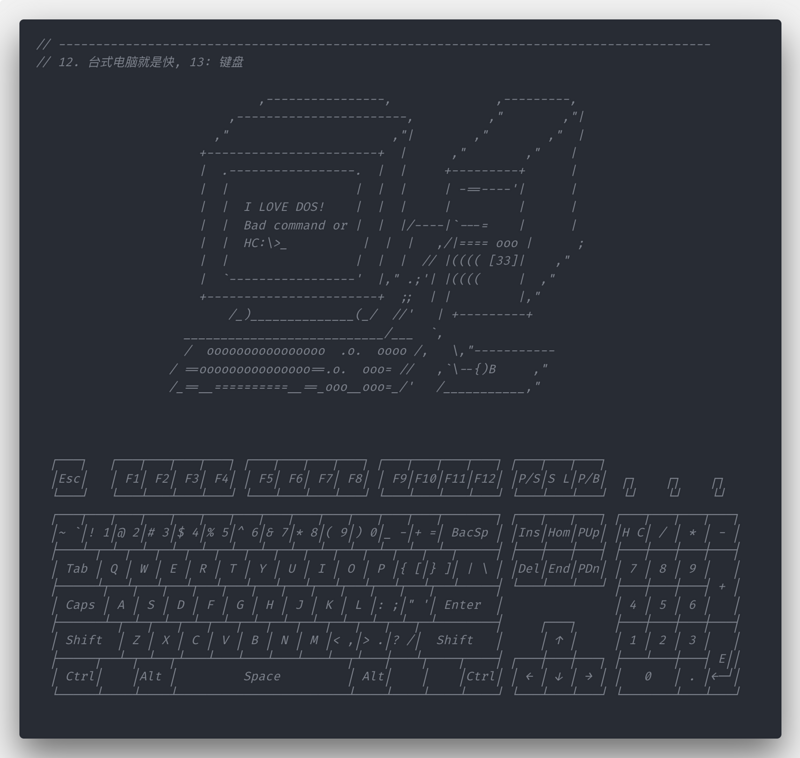
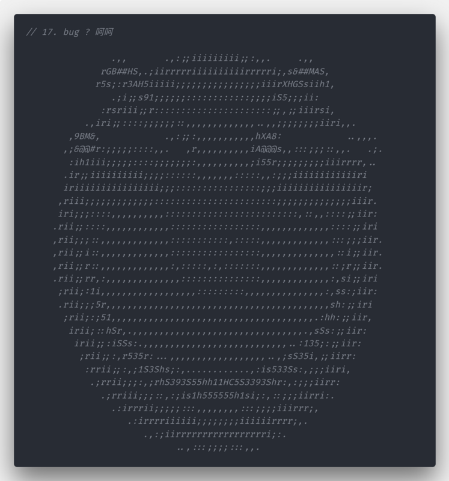

# 有趣的注释，总有你喜欢的那款

需要源码的请点击这里 &nbsp; 💢  &nbsp;&nbsp;️ 👉 👉 👉🏻 👉🏻  &nbsp;&nbsp; [__⭕ 源码链接 ⭕__](./hehe.js)

需要源码的请点击这里 &nbsp; 💢  &nbsp;&nbsp;️ 👉 👉 👉🏻 👉🏻  &nbsp;&nbsp; [__⭕ 源码链接 ⭕__](./hehe.js)

需要源码的请点击这里 &nbsp; 💢  &nbsp;&nbsp;️ 👉 👉 👉🏻 👉🏻  &nbsp;&nbsp; [__⭕ 源码链接 ⭕__](./hehe.js)

> 好看的代码千篇一律，有趣的注释万里挑一， 多图预警！

