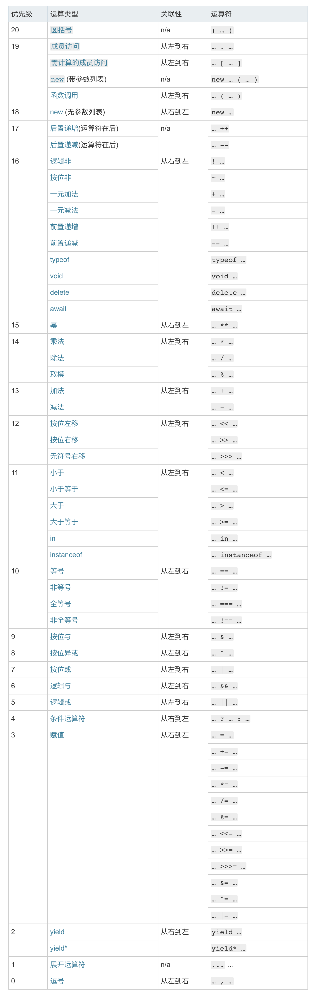
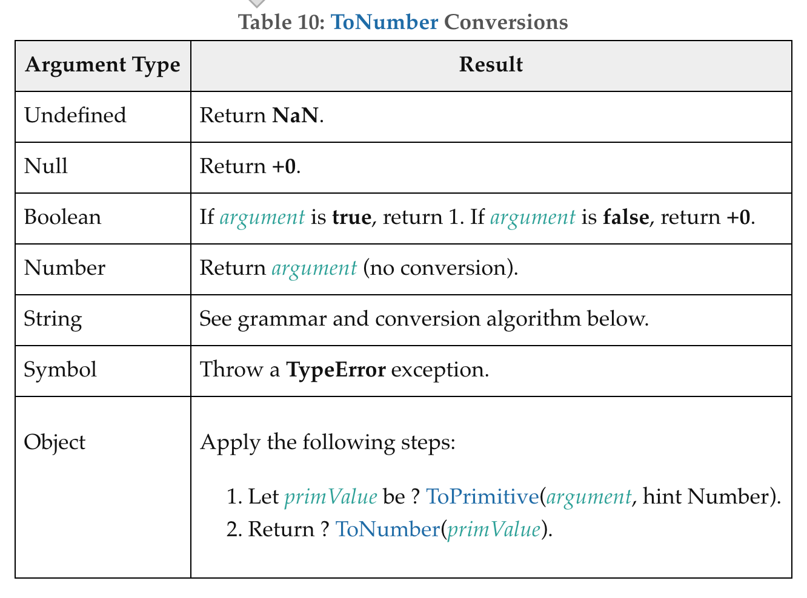
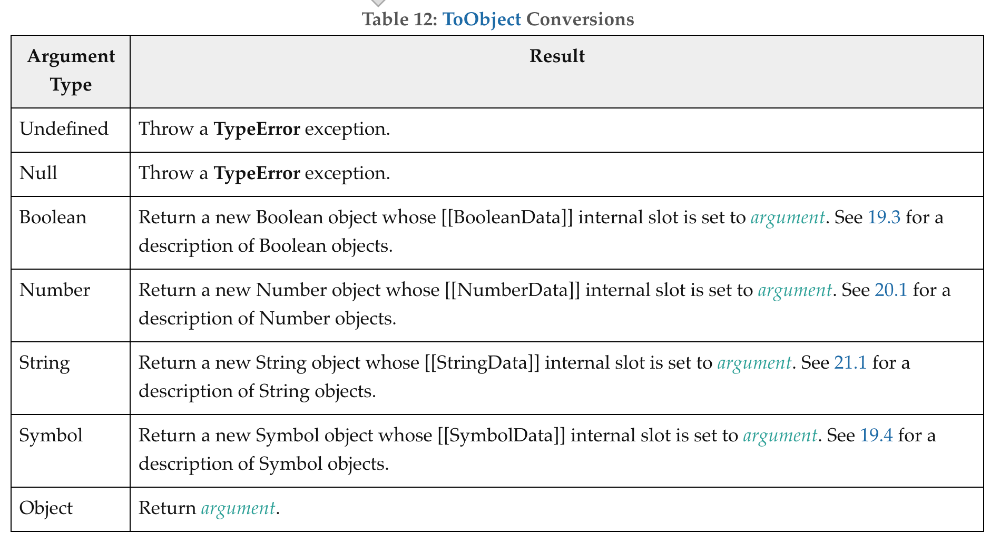

# [] == ![] ?

> 应该是腾讯面试题, 原题更加复杂


面试遇到这种令人头皮发麻的题，该怎么办呢？ 不要慌，我们科学的应对即可。

## 经验法，简称瞎蒙

对于简短而罕见的写法，最好的方法就是经验法，基本原则就是瞎蒙，虽然听着有点扯淡，实际上这不失为一个好办法，对于一个比较陌生的问题，我们通过经验瞎几把猜一个「大众」答案：

简单观察此题，我们发现题目想让一个 数组和他的 非 作比较， 从正常的思维来看，一个数和他的非，应该是不相等的。

> 所以我们 first An is ： false


## 反向操作法

然而你看着面试官淫邪的笑容，突然意识到，问题并不简单，毕竟这家公司还可以，不会来这么小儿科的问题吧。再转念一想，这 tm 的是 js 啊，毕竟 js 经常不按套路出牌啊。

> 于是你又大胆做出了一个假设： [] == ![] 是 true！


大致结论有了， 那该怎么推导这个结论呢？我们逐步分解一下这个问题。分而治之


## 最终结论

后面分析很长，涉及到大篇幅的 ECMAScript 规范的解读，冗长而枯燥，不想看的同学，可以在这里直接拿到结论

> `[] == ![]` -> `[] == false` -> `[] == 0` -> `[].valueOf() == 0` -> `[].toString() == []` -> `'' == 0` -> `0 == 0` -> `true`


## 分析

如果你决定要看，千万坚持看完，三十分钟之后我一定会给你一个惊喜。

这是个奇怪的问题，乍一看形式上有些怪异， 如果面试中你遇到这么个题，应该会有些恼火：这 tm 什么玩意？！ shift！（防和谐梗）。

虽然有点懵，不过还是理性的分析一下，既然这个表达式含有多个运算符， 那首先还是得看看运算符优先级。


### 运算符优先级

> [运算符优先级表](https://developer.mozilla.org/zh-CN/docs/Web/JavaScript/Reference/Operators/Operator_Precedence#Table)




而此题中出现了两个操作符： 「！」， 「==」， 查表可知， 逻辑非优先级是 16， 而等号优先级是 10， 可见先执行 `![]` 操作。在此之前我们先看看 逻辑非

#### 逻辑非 ！

[mozilla 逻辑非： !](https://developer.mozilla.org/zh-CN/docs/Web/JavaScript/Reference/Operators/Logical_Operators)

逻辑运算符通常用于Boolean型（逻辑）值。这种情况，它们返回一个布尔型值。

语法描述： 逻辑非(!)	!expr

- 如果expr能转换为true，返回false；
- 如果expr能转换为false，则返回true。


#### 转 bool

js 中能够转换为false的字面量是可枚举的，包含

- null；
- NaN；
- 0；
- 空字符串（""）；
- undefined。

所以 `![] => false`


> 于是乎我们将问题转化为： `[] == false`


#### == 运算符

这是个劲爆的操作符，正经功能没有，自带隐式类型转换经常令人对 js 刮目相看， 实际上现在网上也没有对这个操作符转换规则描述比较好的，这个时候我们就需要去 ECMAscript 上去找找标准了。

[ECMAScript® 2019 : 7.2.14 Abstract Equality Comparison](https://tc39.github.io/ecma262/#sec-abstract-equality-comparison)

规范描述： The comparison x == y, where x and y are values, produces true or false. Such a comparison is performed as follows:

1. If Type(x) is the same as Type(y), then
    1. Return the result of performing Strict Equality Comparison x === y.
2. If x is null and y is undefined, return true.
3. If x is undefined and y is null, return true.
4. If Type(x) is Number and Type(y) is String, return the result of the comparison x == ! ToNumber(y).
5. If Type(x) is String and Type(y) is Number, return the result of the comparison ! ToNumber(x) == y.
6. If Type(x) is Boolean, return the result of the comparison ! ToNumber(x) == y.
7. If Type(y) is Boolean, return the result of the comparison x == ! ToNumber(y).
8. If Type(x) is either String, Number, or Symbol and Type(y) is Object, return the result of the comparison x == ToPrimitive(y).
9. If Type(x) is Object and Type(y) is either String, Number, or Symbol, return the result of the comparison ToPrimitive(x) == y.
10. Return false.

依据规范 6， 7 可知，存在 bool 则会将自身 ToNumber 转换 [!ToNumber(x) 参考 花絮下的 ！ToNumber， 主要是讲解 ！的意思](#花絮) ! 前缀在最新规范中表示某个过程会按照既定的规则和预期的执行【必定会返回一个 number 类型的值，不会是其他类型，甚至 throw error】

得到： `[] == !ToNumber(false)`

#### ToNumber

[ECMAScript® 2019 : 7.1.3ToNumber](https://tc39.github.io/ecma262/#sec-tonumber)



> If argument is true, return 1. If argument is false, return +0.

可知： `！ToNumber(false) => 0； [] == 0`

然后依据规范 8 9， 执行 `ToPrimitive([])`


#### ToPrimitive

[ECMAScript® 2019 : 7.1.1ToPrimitive ( input [ , PreferredType ] )](https://tc39.github.io/ecma262/#sec-toprimitive)

The abstract operation ToPrimitive converts its input argument to a non-Object type.    [尝试转换为原始对象]

If an object is capable of converting to more than one primitive type, it may use the optional hint PreferredType to favour that type. Conversion occurs according to the following algorithm.   [如果一个对象可以被转换为多种原语类型, 则参考 PreferredType， 依据如下规则转换]


1. Assert: input is an ECMAScript language value.
2. If Type(input) is Object, then
    1. If PreferredType is not present, let hint be "default".
    2. Else if PreferredType is hint String, let hint be "string".
    3. Else PreferredType is hint Number, let hint be "number".
    4. Let exoticToPrim be ? GetMethod(input, @@toPrimitive).
    5. If exoticToPrim is not undefined, then
        1. Let result be ? Call(exoticToPrim, input, « hint »).
        2. If Type(result) is not Object, return result.
        3. Throw a TypeError exception.
    6. If hint is "default", set hint to "number".
    7. Return ? OrdinaryToPrimitive(input, hint).
3. Return input.

大致步骤就是 确定 PreferredType 值[If hint is "default", set hint to "number".]， 然后调用 [GetMethod](https://tc39.github.io/ecma262/#sec-getmethod), 正常情况下 GetMethod 返回 [GetV](https://tc39.github.io/ecma262/#sec-getv), GetV 将每个属性值 ToObject, 然后返回 `O.[[Get]](P, V).`

1. Assert: IsPropertyKey(P) is true.
2. Let O be ? ToObject(V).
3. Return ? O.[[Get]](P, V).

#### [[Get]]

[ECMAScript® 2019 : 9.1.8[[Get]] ( P, Receiver )](https://tc39.github.io/ecma262/#sec-ordinary-object-internal-methods-and-internal-slots-get-p-receiver)

Return the value of the property whose key is propertyKey from this object[检索对象的 propertyKey 属性值]

然后 ToPrimitive step 7 返回 `OrdinaryToPrimitive(input, hint)`

#### OrdinaryToPrimitive( O, hint )

[ECMAScript® 2019 : 7.1.1.1OrdinaryToPrimitive ( O, hint )](https://tc39.github.io/ecma262/#sec-ordinarytoprimitive)

1. Assert: Type(O) is Object.
2. Assert: Type(hint) is String and its value is either "string" or "number".
3. If hint is "string", then
    - Let methodNames be « "toString", "valueOf" ».
4. Else,
    - Let methodNames be « "valueOf", "toString" ».
5. For each name in methodNames in List order, do
    - 5.1 Let method be ? Get(O, name).
    - 5.2 If IsCallable(method) is true, then
        - 5.2.1 Let result be ? Call(method, O).
        - 5.2.2 If Type(result) is not Object, return result.
6. Throw a TypeError exception.

上述过程说的很明白： 如果 hint is String，并且他的 value 是 string 或者 number【ToPrimitive 中给 hint 打的标签】,接下来的处理逻辑，3，4 步描述的已经很清楚了。

步骤 5，则是依次处理放入 methodNames 的操作[这也解答了我一直以来的一个疑问，网上也有说对象转 string 的时候，是调用 tostring 和 valueof， 但是总是含糊其辞，哪个先调用，哪个后调用，以及是不是两个方法都会调用等问题总是模棱两可，一句带过 /手动狗头]。

#### 推论

该了解的基本上都梳理出来了， 说实话，非常累，压着没有每个名词都去发散。不过大致需要的环节都有了.

我们回过头来看这个问题： 在对 == 操作符描述的步骤 8 9中，调用 `ToPrimitive(y)` 可见没指定 PreferredType, 因此 hint 是 default，也就是 number【参考： 7.1.1ToPrimitive 的步骤2-f】

接着调用 `OrdinaryToPrimitive(o, number)` 则进入 7.1.1.1OrdinaryToPrimitive 的步骤 4 ，然后进入步骤 5 先调用 valueOf，步骤 5.2.2 描述中如果返回的不是 Object 则直接返回，否则才会调用 toString。

所以 `[] == 0` => `[].valueOf()[.toString()] == 0`. 我们接着来看 数组的 valueOf 方法, 请注意区分一点，js 里内置对象都继承的到 valueOf 操作，但是部分对象做了覆写， 比如 [String.prototype.valueOf](https://tc39.github.io/ecma262/#sec-string.prototype.valueof)，所以去看看 Array.prototype.valueOf 有没有覆写。

结果是没有，啪啪打脸啊，尼玛，于是乎我们看 Object.prototype.valueOf

#### Array.prototype.valueOf from Object.prototype.valueOf

[ECMAScript® 2019 : 19.1.3.7Object.prototype.valueOf ( )](https://tc39.github.io/ecma262/#sec-object.prototype.valueof)

When the valueOf method is called, the following steps are taken:

1. Return ? ToObject(this value).
This function is the %ObjProto_valueOf% intrinsic object.

我们接着看 ToObject【抓狂，但是要坚持】。

#### ToObject

[ECMAScript® 2019 : 7.1.13ToObject ( argument )](https://tc39.github.io/ecma262/#table-13)



Object ： Return argument?!  这步算是白走了。我们接着看 toString，同样的我们要考虑覆写的问题。

#### Array.prototype.toString()

[ECMAScript® 2019 : 22.1.3.28Array.prototype.toString ( )](https://tc39.github.io/ecma262/#sec-array.prototype.tostring)

1. Let array be ? ToObject(this value).
2. Let func be ? Get(array, "join").
3. If IsCallable(func) is false, set func to the intrinsic function %ObjProto_toString%.
4. Return ? Call(func, array).

可见调用了 join 方法【ps： 这里面还有个小故事，我曾经去滴滴面试，二面和我聊到这个问题，我说数组的 toString 调用了 join ，面试官给我说，你不要看着调用结果就臆测内部实现，不是这样思考问题的...... 我就摇了摇头，结果止步二面，猎头反馈的拒绝三连： 方向不匹配，不适合我们，滚吧。😂 😂 😂 】

通过非常艰辛的努力我们走到了这一步

> `[].valueOf().toString() == 0` => `[].join() == 0` => `'' == 0`

__如果你也认真看到这一步，不妨在博客提个 issue 留下联系方式，交个朋友 ^_^。__

接着我们看到两边还是不同类型，所以类型转换还得继续， 我们回到 7.2.14 Abstract Equality Comparison 的步骤 4 5 ,

- 4. If Type(x) is Number and Type(y) is String, return the result of the comparison x == ! ToNumber(y).
- 5. If Type(x) is String and Type(y) is Number, return the result of the comparison ! ToNumber(x) == y.

可见 '' 需要 ToNumber, 我们在上面讲述了 [ToNumber](#ToNumber) 以及转换映射表, 表格里说的很清楚『 String	See grammar and conversion algorithm below. 』....

#### ToNumber Applied to the String Type

[ECMAScript® 2019 : 7.1.3.1ToNumber Applied to the String Type](https://tc39.github.io/ecma262/#sec-tonumber-applied-to-the-string-type)

可惜这一步描述的非常抽象

```S
StringNumericLiteral:::
    StrWhiteSpaceopt
    StrWhiteSpaceoptStrNumericLiteralStrWhiteSpaceopt
StrWhiteSpace:::
    StrWhiteSpaceCharStrWhiteSpaceopt
StrWhiteSpaceChar:::
    WhiteSpace
    LineTerminator
StrNumericLiteral:::
    StrDecimalLiteral
    BinaryIntegerLiteral
    OctalIntegerLiteral
    HexIntegerLiteral
StrDecimalLiteral:::
    StrUnsignedDecimalLiteral
    +StrUnsignedDecimalLiteral
    -StrUnsignedDecimalLiteral
StrUnsignedDecimalLiteral:::
    Infinity
    DecimalDigits.DecimalDigitsoptExponentPartopt
    .DecimalDigitsExponentPartopt
    DecimalDigitsExponentPartopt
```

具体分解如下：

[ECMAScript® 2019 : 11.8.3Numeric Literals](https://tc39.github.io/ecma262/#sec-literals-numeric-literals)

确认过眼神，是我搞不定的人！

不过我们还有 Mozilla : [Number("")      // 0](https://developer.mozilla.org/zh-CN/docs/Web/JavaScript/Reference/Global_Objects/Number#%E8%BD%AC%E6%8D%A2%E6%95%B0%E5%AD%97%E5%AD%97%E7%AC%A6%E4%B8%B2%E4%B8%BA%E6%95%B0%E5%AD%97)

所以最终答案就转化为：

> `'' == 0` => `0 == 0`


__哦，大哥，原来这 tm 就是惊喜啊！小弟我愿意... 愿意个鬼啊！__


## Final answer

> __true__


## 胡说八道

- Q： 这么做是矫枉过正么？
- A： 我喜欢技术，我喜欢把她弄得一丝不挂。【ps： 网上很多帖子信口开河，说的东西全无依据，结果是看帖成了纠错的过程，还是自己来吧】

- Q： 有人会认认真真看到这里么？
- A： 被我面试过的同学里应该有人能认真看到这里。【ps：爱看不看】

- Q： 这么做有什么用啊？
- A： 没用，下一个。【ps： 面试中也经常有人问我这个问题，我认为这本质上是你对自己定位的问题，你定位自己是前端，就学应用层，你定位自己是程序员，就看全栈，如果你定位自己是工程师，就看底层，看规范。工作五年以上的程序员，不应该问这个问题。【pss： 我定位自己就是爱好，于是我就瞎鸡儿看】】

- Q： 工作中用的到么？ 工作这么忙哪来的时间？
- A： pass.

- Q： 这么写博客，累么？
- A： 很累，我要查很多很多资料，还要甄别，很多英文文档，对我这个持有「大不列颠负十级的英语认证」的人来说，简直就是美利坚版诗经。一篇博客，起码三四天起。而且大家看起来也需要基础和成本，我也不知道能坚持多久。

- Q：...
- A：...

如果你也有问题， 请点开 issue ，加上去吧，不想踩坑的技术可以提上去，问题也可以提上去。

- blog: [https://github.com/HCThink/h-blog](https://github.com/HCThink/h-blog)
- issue: [https://github.com/HCThink/h-blog/issues](https://github.com/HCThink/h-blog/issues)

## 花絮

### ！ToNumber / ? ToNumber

- ！前缀

[ECMAScript® 2019 : 5.2.3.4 ReturnIfAbrupt Shorthands](https://tc39.github.io/ecma262/#sec-returnifabrupt-shorthands)

Similarly, prefix ! is used to indicate that the following invocation of an abstract or syntax-directed operation will never return an abrupt completion[The term “abrupt completion” refers to any completion with a [[Type]] value other than normal.] and that the resulting Completion Record's [[Value]] field should be used in place of the return value of the operation. For example, the step:

- Let val be ! OperationName().
is equivalent to the following steps:

1. Let val be OperationName().
2. Assert: val is never an abrupt completion.
3. If val is a Completion Record, set val to val.[[Value]].
Syntax-directed operations for runtime semantics make use of this shorthand by placing ! or ? before the invocation of the operation:

- Perform ! SyntaxDirectedOperation of NonTerminal.

大意是： !后面的语法操作的调用永远不会返回突然的完成，我理解是一定会执行一个预期的结果类型，执行步骤就是 上述 1， 2， 3步骤。 ！ToNumber 描述的是 一定会讲操作数转换为 number 类型并返回 val.[[value]]

- ?前缀  同理， 就不一一展开了，太多「逃」。

[ECMAScript® 2019 : 5.2.3.4 ReturnIfAbrupt Shorthands](https://tc39.github.io/ecma262/#sec-returnifabrupt-shorthands)

Invocations of abstract operations and syntax-directed operations that are prefixed by ? indicate that ReturnIfAbrupt should be applied to the resulting Completion Record.
