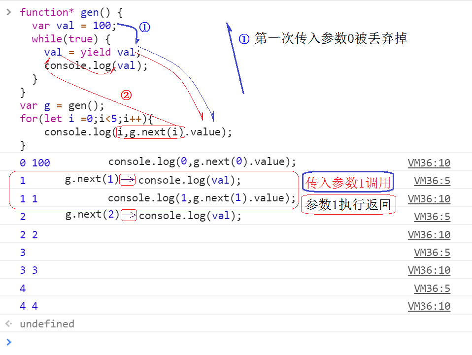

# Generator

> 可以随心所欲的交出和恢复函数的执行权，yield交出执行权，next()恢复执行权

> Generator 函数是一个状态机，封装了多个内部状态，执行一个Generator函数会返回一个迭代器对象，可以依次遍历 Generator 函数内部的每一个状态

调用一个生成器函数并不会马上执行它里面的语句，而是返回一个这个 generator 的 迭代器 （iterator ）对象。当这个迭代器的 next() 方法被首次（后续）调用时，其内的语句会执行到第一个（后续）出现yield的位置为止，yield 后紧跟迭代器要返回的值。

或者如果用的是 yield*（多了个星号），则表示将执行权移交给另一个生成器函数（当前生成器暂停执行）。

next()方法返回一个对象，这个对象包含两个属性：value 和 done，value 属性表示本次 yield 表达式的返回值，done 属性为布尔类型，表示生成器后续是否还有 yield 语句，即生成器函数是否已经执行完毕并返回。


## 典型场景

- [co](../../../source/co/readme.md)
- [async/await](../async-await/readme.md)

依赖 async 的上层库和应用不胜枚举，比如 koa

koa 等依赖其上层语法糖封装： [koa](../../../source/koa2/readme.md)


## 基本使用

#### code

function* 这种声明方式(function关键字后跟一个星号）会定义一个生成器函数 (generator function)，它返回一个  Generator  对象。

> 更多 demo 参考： [迭代器](./code/generator.1.ts) , [常见数列生成器](./code/generator.2.ts)

```typescript
// 斐波那契竖列生成器
function* fib() {
    let [x, y]: [number, number] = [0, 1];
    while (true) {
      [x, y] = [y, x + y];
      yield x;
    }
}

const generator: Generator = fib();

// 阶乘
function* factorial() {
    let x: number = 1;
    let fac: number = 1;
    while (true) {
        yield fac;
        fac = fac * ++x;
    }
}
```

#### [Generator 对象](https://developer.mozilla.org/zh-CN/docs/Web/JavaScript/Reference/Global_Objects/Generator)

调用一个生成器函数并不会马上执行它里面的语句，而是返回这个生成器的 迭代器 （实现 iterator ）的对象 Generator, 所以它符合[可迭代协议](https://developer.mozilla.org/zh-CN/docs/Web/JavaScript/Reference/Iteration_protocols#iterable)和[迭代器协议](https://developer.mozilla.org/zh-CN/docs/Web/JavaScript/Reference/Iteration_protocols#iterator)。如上述代码中 `const generator: Generator = fib();` 接受 fib() 的类型即： Generator

Generator 对象

- Generator.prototype.next()
> 返回一个由 yield表达式生成的值。

- Generator.prototype.return()
> 返回给定的值并结束生成器。

- Generator.prototype.throw()
> 向生成器抛出一个错误。


#### yield 优先级

[操作符优先级汇总](https://developer.mozilla.org/zh-CN/docs/Web/JavaScript/Reference/Operators/Operator_Precedence#Table)

yield 仅仅比 展开运算符: `...`, 逗号： `,` 的优先级高，所以注意区分 `yield fn() + 10` 中 `fn() + 10` 才是 yield 表达式。


#### generator 中断 的入参和返回

[generator 入参返回](./code/generator.3.ts)

注意，不是要说整个 generator 的出入参，而是 yield 和 next，这个问题，其实困扰我蛮久的，原因是 generator 和传统 js 的函数调用区别很大， 如果你很熟悉普通函数调用的出入参,在这里往往转不过弯。

- 返回: next() 返回类 `{ done: boolean, value: any  }` 对象， 其中 value 则是 yield 表达式的值。

实际上返回会好理解一些，当我们执行 generator 函数之后获得一个 Generator 对象当我们第一次调用 GeneratorObj.next() 时，函数才会开始执行，直到第一个 yield 表达式执行完成， 并将 yield 表达式结果提供给 next 进行返回。【注意 yield 表达式此时开始执行】，然后进入中断。

```js
function pi(n: number): number {
    return Math.PI * n;
}

function* fn(n: number) {
    // 第一个 next 调用后 yield 表达式【pi(n) + 10， 注意优先级】执行并将结果： 13.1415... 进行包装
    // { value： 13.14..., done: false }
    let g1 = yield pi(n) + 10;
    // 同理这里就是： { value: 3.141592653589793, done: false }
    g1 = (yield pi(n)) + 10;

    // return 等价一最后一个 yield。
    return 100;
}

const fnGenx: Generator = fn(1);
Log(fnGenx.next());         // { value: 13.141592653589793, done: false }
Log(fnGenx.next());         // { value: 3.141592653589793, done: false }
Log(fnGenx.next());         // { value: 100, done: true }
```

当在生成器函数中显式 return 时，会导致生成器立即变为完成状态，即调用 next() 方法返回的对象的 done 为 true。如果 return 后面跟了一个值，那么这个值会作为当前调用 next() 方法返回的 value 值。

调用 next 时会立即获得 yield 表达式的执行结果。也就是说 yield 不能单独处理异步，因为 yield 其实不在意其后的表达式所有代码执行结束的时间点。因此也无法确定下次 next 的调用时间点。


- 入参: next 方法也可以通过接受一个参数用以向生成器传值。请注意，首次调用 next 方法时参数会被丢弃。next 入参规则如下：

__调用 next()方法时，如果传入了参数，那么这个参数会作为上一条执行的  yield 语句的返回值__

实际上往往会误认为 `let g1 = （yield x10(n)） + 10;` 中 yield 表达式的值就会直接赋值给 g1 其实并不是这样的，yield 表达式的值是 next 的返回值，当下次 next（100） 传入的值会替代上一个 yield 表达式的值。也就等价于 `g1 = （100） + 10`

```typescript
function x10(n: number): number {
    return 10 * n;
}

function* fn(n: number) {
    // yield x10(n) + 10 结果为：30， 下次 next 时传入的值做了 +10， 则 g1 值为： 40
    let g1 = yield x10(n) + 10;
    Log(g1);            // 40
    // 同理： (yield x10(g1)) 结果为： 40 * 10 = 400， 下次 next 时传入的值： 400 + 10 = 410
    // 代入中断的点： g1 = 410（yield x10(g1)） + 10 =  420
    g1 = (yield x10(g1)) + 10;
    Log(g1);            // 420
}

// 第一个参数由生成器提供
const fnGenx: Generator = fn(2);
let genObj = fnGenx.next(100);    // 第一次入参会被丢弃， 因为他没有上一个 yield

while (!genObj.done) {
    Log("outer: ", genObj.value);
    genObj = fnGenx.next(genObj.value + 10);
}

// outer:  30
// 40
// outer:  400
// 420
```

#### [一个官方 demo](https://developer.mozilla.org/zh-CN/docs/Web/JavaScript/Reference/Global_Objects/Generator/next#%E5%90%91%E7%94%9F%E6%88%90%E5%99%A8%E4%BC%A0%E5%80%BC)

```js
/** gen函数运行解析：
 * i=0 时传入参数(0)，并将参数0赋给上一句yield的返回赋值，由于没有上一句yield语句，这步被忽略
 * 执行var val =100，然后执行yield val，此时g.next(i)返回{ value: 100, done: false }
 * 然后console.log(i,g.next(i).value)，打印出0 100
 *
 * i=1 时传入参数(1)，并将参数1赋给上一句yield的返回赋值,即(val = 1)
 * 然后执行console.log(val)，打印出1。
 * 接着进入第二次while循环，调用yield val，此时g.next(i)返回{ value: 1, done: false }
 * 然后console.log(i,g.next(i).value)，打印出1 1
 *
 * i=2 ....(省略)
 */
function* gen() {
   var val =100;
   while(true) {
      val = yield val;
      console.log(val);
   }
}

var g = gen();
for(let i =0;i<5;i++){
   console.log(i,g.next(i).value);
}

// 返回：
//  0 100
//  1
//  1 1
//  2
//  2 2
//  3
//  3 3
//  4
//  4 4
```




#### yield*

如果 yield* Generator， 可以等价认为将 这个 Generator 的所有 yield 插入到 当前位置

```js
function* anotherGenerator(i) {
    yield i + 1;
    yield i + 2;
    yield i + 3;
}

function* generator(i){
    yield i;
    yield* anotherGenerator(i);// 移交执行权
    yield i + 10;
}

// 等价于
function* generator(i){
    yield i;
    //   yield* anotherGenerator(i);// 移交执行权
    yield i + 1;
    yield i + 2;
    yield i + 3;
    yield i + 10;
}
```


## 注意点

1. next 的参数会作为上一条执行的  yield 语句的返回值: `let first = yield 1;` 中 first 不是直接赋值为 yield 表达式的值， 而是 下次 next 传入的值。
2. 生成器函数不能当做构造器使用。
```js
function* f() {}
var obj = new f; // throws "TypeError: f is not a constructor"
```
3. yield 表达式是立即执行的，并且返回表达式值， 如果 yield 表达式是异步的，你需要在恰当的时机触发 next 才能达到 async 的执行顺序。在『重要问题 generator & 异步』中有详细讲解
4. generator 和异步机制不同，只是配合 generator + 执行器可以 '同步化' 处理异步, Generator 函数是ES6提供的一种异步编程解决方案
5. “中断”是 Generator 的重要特征 ———— Generator 能让一段程序执行到指定的位置先中断，启动。


## babel 转译

[参考： demo](https://babeljs.io/repl#?babili=false&browsers=&build=&builtIns=false&spec=false&loose=false&code_lz=GYVwdgxgLglg9mABAKgOYFMwAoAOBKRAbwChFEIEBnOAG3QDoa5Vc9TyqpEATdARkQBeRAE8Y6Gt0TBs-ANzsKYanUbMsvPmzJLKXXgCYho8ZOnZNeBTqq0GTFobYBfYm9CRYCc6yLEAkABO6FAggUgAsgCGUAAW9IFRYNxwALZYBMiIOAqubkA&debug=false&forceAllTransforms=false&shippedProposals=false&circleciRepo=&evaluate=false&fileSize=true&timeTravel=true&sourceType=module&lineWrap=true&presets=es2015%2Creact%2Cstage-2&prettier=false&targets=&version=6.26.0&envVersion=)

```js
function *gen(p) {
  console.log(p)
  const de1 = yield fn(p);
  console.log(de1)
  const de2 = yield fn(de1);
  console.log(de2)
}

function fn(p) {
    return Math.random() * p;
}
```

通过 babel 编译为

```js
"use strict";
var _marked = /*#__PURE__*/regeneratorRuntime.mark(gen);
function gen(p) {
  var de1, de2;
  return regeneratorRuntime.wrap(function gen$(_context) {
    while (1) {
      switch (_context.prev = _context.next) {
        case 0:
          console.log(p);
          _context.next = 3;
          return fn(p);
        case 3:
          de1 = _context.sent;
          console.log(de1);
          _context.next = 7;
          return fn(de1);
        case 7:
          de2 = _context.sent;
          console.log(de2);
        case 9:
        case "end":
          return _context.stop();
      }
    }
  }, _marked, this);
}

function fn(p) {
  return Math.random() * p;
}
```

可以看到 babel 使用了一个诸如的对象： `regeneratorRuntime` 在不支持的环境 polyfill，这个对象解析出现在 babel 的 `babel-plugin-transform-runtime` 插件中.

- [插件目录](https://github.com/babel/babel/tree/master/packages/babel-plugin-transform-runtime)
- [source](https://github.com/babel/babel/blob/master/packages/babel-plugin-transform-runtime/src/index.js#L200)

```js
const moduleName = injectCoreJS2
    ? "@babel/runtime-corejs2"
    : "@babel/runtime";
let modulePath = moduleName;

if (node.name === "regeneratorRuntime" && useRuntimeRegenerator) {
    path.replaceWith(
    this.addDefaultImport(
        `${modulePath}/regenerator`,
        "regeneratorRuntime",
    ),
    );
    return;
}
```

继续跟进到 `babel-runtime-corejs2/regenerator/index.js, babel-runtime/regenerator/index.js` 文件中, 两个文件均只有一行代码： `module.exports = require("regenerator-runtime");` 都使用了 fackbook 的 regenerator

- [regenerator](https://github.com/facebook/regenerator/tree/master/packages/regenerator-runtime)
- [regenerator 源码分析参考](../../../source/regenerator/readme.md)


## 支撑思想： [__协程__](https://blog.csdn.net/shenlei19911210/article/details/61194617)

> 协程，又称微线程，纤程. 是一种非抢占式资源调度单元, 是一个无优先级的轻量级的用户态线程

### 前期知识准备

现代操作系统是分时操作系统，资源分配的基本单位是进程，CPU调度的基本单位是线程。

简单来说，进程(Process), 线程(Thread)的调度是由操作系统负责，线程的睡眠、等待、唤醒的时机是由操作系统控制，开发者无法精确的控制它们。使用协程，开发者可以自行控制程序切换的时机，可以在一个函数执行到一半的时候中断执行，让出CPU，在需要的时候再回到中断点继续执行。

- 上下文: 指的是程序在执行中的一个状态。通常我们会用调用栈来表示这个状态——栈记载了每个调用层级执行到哪里，还有执行时的环境情况等所有有关的信息。
- 调度: 指的是决定哪个上下文可以获得接下去的CPU时间的方法。
- 进程: 是一种古老而典型的上下文系统，每个进程有独立的地址空间，资源句柄，他们互相之间不发生干扰。
- 线程: 是一种轻量进程，实际上在linux内核中，两者几乎没有差别，除了线程并不产生新的地址空间和资源描述符表，而是复用父进程的。 但是无论如何，线程的调度和进程一样，必须陷入内核态。

### 协程

传统的编程语言，早有多任务的解决方案，其中有一种叫做"协程"（coroutine），意思是多个线程互相协作，完成异步任务， 这和普通的抢占式线程有所不同。

JS 中 generator 就类似一个语言层面实现的非抢占式的轻量级"线程"。 线程包含于进程，而协程包含于线程

- 所以协程具有极高的执行效率。因为子程序切换不是线程切换，而是由程序自身控制，因此，没有线程切换的开销，和多线程比，线程数量越多，协程的性能优势就越明显。
- 不需要多线程的锁机制
- 线程由系统控制切换，协程是由用户控制切换。

从更高的层面来讲，协程和多线程是两种解决“多任务”编程的技术。多线程使得 '同一时刻貌似' 有多个线程在并发执行，不过需要在多个线程间协调资源，因为多个线程的执行进度是“不可控”的。而协程则避免了多线程的问题，同一时刻实质上只有一个“线程”在执行，所以不会存在资源“抢占”的问题。

不过在 JS 领域，貌似不存在技术选择的困难，因为 JS 目前还是“单线程”的，所以引入协程也是很自然的选择吧。


### 协程 & 函数栈

大多语言都是层级调用，比如A调用B，B在执行过程中又调用了C，C执行完毕返回，B执行完毕返回，最后是A执行完毕。所以子程序调用是通过栈实现的，一个线程就是执行一个子程序。子程序调用总是一个入口，一次返回，调用顺序是明确的。

而协程的调用和子程序不同。协程看上去也是子程序，但执行过程中，在子程序内部可中断，然后转而执行别的子程序，在适当的时候再返回来接着执行。

### 协程的中断: 实际上是挂起的概念

协程发起异步操作意味着该协程将会被挂起，为了保证唤醒时能正常运行，需要正确保存并恢复其运行时的上下文。记录步骤为：

- 保存当前协程的上下文（运行栈，返回地址，寄存器状态）
- 设置将要唤醒的协程的入口指令地址到IP寄存器
- 恢复将要唤醒的协程的上下文

可以参考 libco 腾讯开源的一个C++协程库，作为微信后台的基础库，经受住了实际的检验: [libco](https://github.com/Tencent/libco)


### JS 协程： generator

js 的生成器也是一种特殊的协程，它拥有 yield 原语，但是却不能指定让步的协程，只能让步给生成器的调用者或恢复者。由于不能多个协程跳来跳去，生成器相对主执行线程来说只是一个可暂停的玩具，它甚至都不需要另开新的执行栈，只需要在让步的时候保存一下上下文就好。因此我们认为生成器与主控制流的关系是不对等的，也称之为非对称协程（semi-coroutine）。

因此一般的协程实现都会提供两个重要的操作 Yield 和 Resume（next）。

### Generator 实现协程的问题

- 在协程执行中不能有阻塞操作，否则整个线程被阻塞(协程是语言级别的，线程，进程属于操作系统级别)
- 需要特别关注全局变量、对象引用的使用
- yield 仅能存在于 生成器内部[对比 node-fibers]

### 真.协程

所谓的真协程是相对 generator 而言的， node-fibers 库提供了对应的实现，我们用一个例子部分代码说明二者区别

```js
import Fiber from 'fibers'
function fibersCo () {    /* 基于 fibers 的执行器 ..... */    }
fibersCo(() => {
    let foo1 = a => {
        console.log('read from file1');
        let ret = Fiber.yield(a);
        return ret;
    };
    let foo2 = b => {
        console.log('read from file2');
        let ret = Fiber.yield(b);
        return ret;
    };
    let getSum = () => {
        let f1 = foo1(readFile('/etc/fstab'));
        let f2 = foo2(readFile('/etc/shells'));
        return f1.toString().length + f2.toString().length;
    };

    let sum = getSum();
});
```

通过这个代码可以发现，在第一次中断被恢复的时候，恢复的是一系列的执行栈！从栈顶到栈底依次为：foo1 => getSum => fibersCo 里的匿名函数；而使用生成器，我们就无法写出这样的程序，因为 yield 原语只能在生产器内部使用, SO

> __无论什么时候被恢复，都是简单的恢复在生成器内部，所以说生成器的中断是不开调用栈滴。__


## 重要问题

### generator & 异步

1. generator 流程控制 和 异步处理

generator yield 的执行机制在流程控制上，有这其他语法无可比拟的优势。

generator 机制和异步有所不同， Generator 和普通函数本质区别在于 Generator 能让一段程序执行到指定的位置,然后交出执行栈，调用下次 next 的时候又会从之前中断的位置继续开始执行，配合这种机制处理异步，则会产生同步化异步处理的效果。

2. generator 的问题

但其实很快发现 generator 不能单独处理异步问题，原因在于

- generator 无法获取下次 next 的时机。
- generator 无法自执行

3. generator 处理异步的思路 + 实践

使用 Generator 函数来处理异步操作的基本思想就是在执行异步操作时暂停生成器函数的执行，然后在阶段性异步操作完成的状态中通过生成器对象的next方法让Generator函数从暂停的位置恢复执行，如此往复直到生成器函数执行结束。简单来讲其实就是将异步串行化了。

也正是基于这种思想，Generator函数内部才得以将一系列异步操作写成类似同步操作的形式，形式上更加简洁明了。

而要让Generator函数按顺序自动完成内部定义好的一系列异步操作，还需要配套的执行器。与之配套的有两种思路

- [thunk](../thunk/readme.md)
- [promise](../promise/readme.md)

其实在 async/await 之前就已经有了 co 库使用此两种方案实现类似 async 的机制。参考 co 源码分析

- [co 源码分析](../../../source/co/readme.md)

4. 优势： 异常捕获。 generator 的异常捕获模型，优于 promise。
```js
function* gen(x){
  try {
    var y = yield x + 2;
  } catch (e){
    console.log(e);
  }
  return y;
}
```


### generator 的 yield 会产生调用函数栈么？

因为 yield 原语只能在生产器内部使用, 所以无论什么时候被恢复，都是简单的恢复在生成器内部。所以说生成器的中断是不开调用栈滴。

参考上述章节

- [真.协程](#真协程)
- [中断/函数栈](#协程的中断-实际上是挂起的概念)


## 上层应用

async / await
- [async / await](../async-await/readme.md)， [co](../../../source/co/readme.md)

并发通信: 多个generator函数结合在一起，让他们独立平行的运行，并且在它们执行的过程中来来回回得传递信息
- [csp : 并行（多个 generator 微线程通讯）](../csp/readme.md)


## 参考

- [function* api](https://developer.mozilla.org/zh-CN/docs/Web/JavaScript/Reference/Statements/function*)
- [Generator api](https://developer.mozilla.org/zh-CN/docs/Web/JavaScript/Reference/Global_Objects/Generator)
- https://cnodejs.org/topic/58ddd7a303d476b42d34c911
- https://www.cnblogs.com/wangfupeng1988/p/6532713.html
- https://github.com/Jocs/jocs.github.io/issues/12
- https://cnodejs.org/topic/58ddd7a303d476b42d34c911
- https://brooch.me/2016/12/30/process-thread-and-coroutine-in-javascript/
- https://blog.csdn.net/shenlei19911210/article/details/61194617
